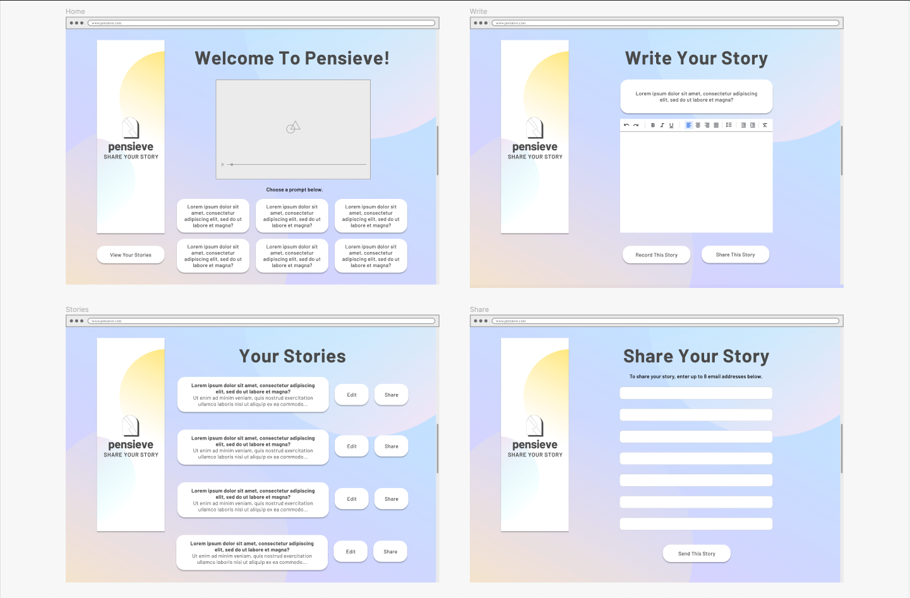
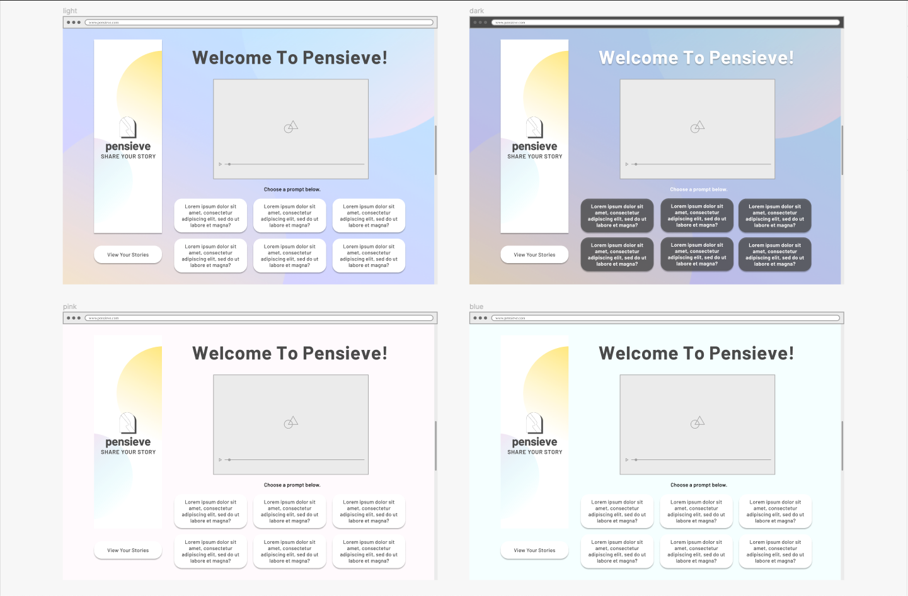
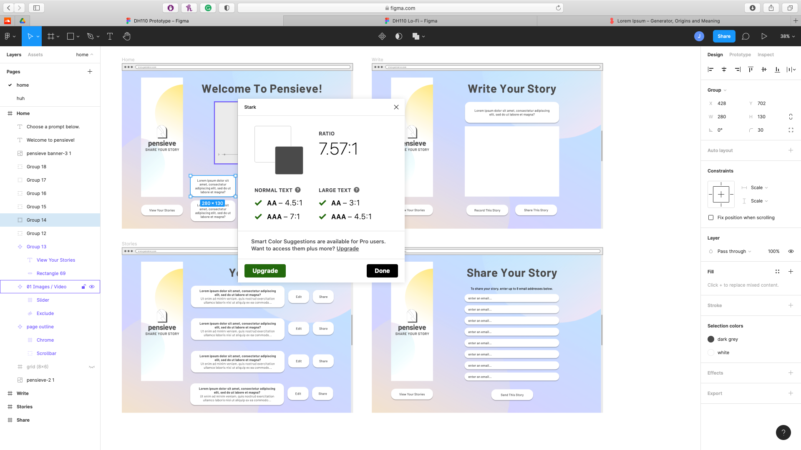
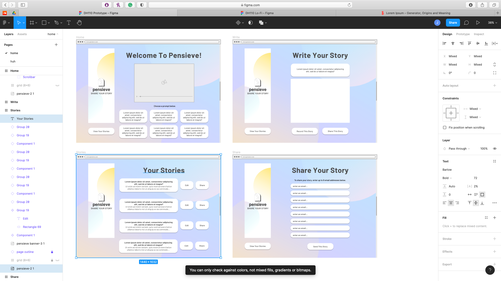
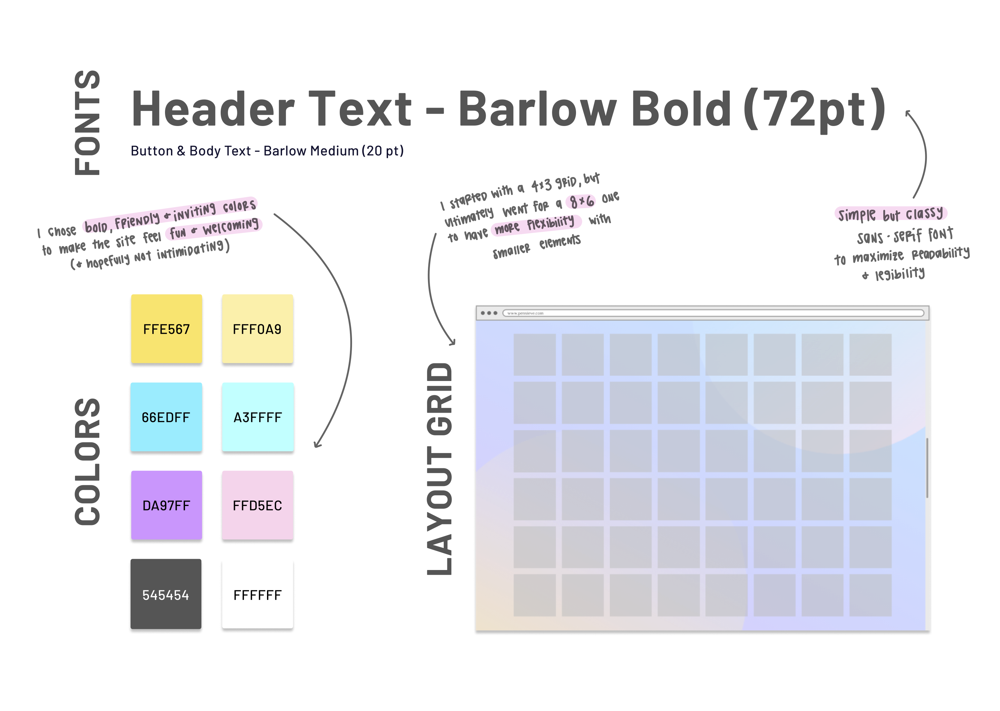

# DH110-JoyHsieh-Assignment06
## Introduction
This project is for a platform called **Pensieve**. The goal of Pensieve is to help senior citizens record their life stories and share them with friends and family. When it is complete, this high-fidelity prototype will help me visualize the design, make usability improvements, and optimize the design. For now, this high-fidelity wireframe will showcase the design of the final product.  

This prototype will allow users to:

- watch a tutorial video to learn how to use the website
- select a prompt to write about
- write a story
- upload a video or voice recording of a story
- view stories that were previously written
- share the story with others

## Screen Design

view the design on [Figma](https://www.figma.com/file/1u7553IPa6LgAZey8nxkDp/DH110-Prototype?node-id=0%3A1).

### Design Variations

## Impression Test
I asked some friends to take a look at the screen design and design variations. Here is what they said:

**Sharon**
> The colorful background creates a nice contrast and makes the buttons you can press easier to see. I like the color background with the white prompt boxes because it looks more cohesive.

**Hellen**
> I like the pink one hahaha i just think it’s neat!

**Andy**
> The colors are nice. I like the rainbow one best. I don't know how practical it is to share by email. You should do a link or something instead.

Overall, the lighter colored designs had a more favorable impression. I'm going to take Andy's suggestion into account for my next revision.

## Accessibility Check

Unfortunately, Stark is not able to check text against multicolored backgrounds so I was limited in what I could test. See the error message below.

## Design System

## Interactive Prototype
view the prototype on [Figma](https://www.figma.com/proto/1u7553IPa6LgAZey8nxkDp/DH110-Prototype?node-id=6%3A891&scaling=min-zoom&page-id=0%3A1).

#### Task A: Write a Story
- Select a prompt
- Write the story
- Share the story
- Return Home

#### Task B: Share a Story
- See previously written stories
- Share the story
- Return Home

## Wireflow

